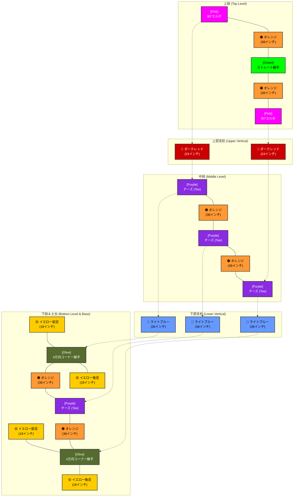

# 📐 持ち運び式 運動会得点板 — PVCカット＆組立設計図 (Portable Undokai Scoreboard)

ご提示いただいたHome Depotの買い物リスト、フレーム構造のカラー図面、および芝生のグラウンドに設置された実物写真に基づき、**1.5インチ スケジュール40 PVCパイプ（10フィート/120インチ × 4本）**からすべてのパーツを最も効率的かつ安全に切り出すためのカットプランと、組み立てガイドを日本語で分かりやすく整理しました。

この設計図があれば、のこぎりの刃の厚み（約1/8インチ）によるロスを気にせず、**6インチ〜12インチの十分な余白（マージン）**を残してスムーズに切り出すことができます！

---

## 🎨 必要パーツ一覧 (全15パーツ)

図面のカラーコードに対応したカット寸法です。

| パイプ色 | 部位・役割 | カット寸法 | 数量 | 合計長さ |
| :--- | :--- | :--- | :---: | :--- |
| 🟠 **オレンジ** | 水平フレームバー (上段・中段・下段) | **36インチ** (約91.4cm) | 6本 | 216インチ |
| 🔵 **ライトブルー** | 下部垂直支柱 (ベースから中段まで) | **36インチ** (約91.4cm) | 3本 | 108インチ |
| 🔴 **ダークレッド** | 上部垂直支柱 (中段から上段まで) | **24インチ** (約61.0cm) | 2本 | 48インチ |
| 🟡 **イエロー** | 土台の足 (前後レッグ) | **18インチ** (約45.7cm) | 4本 | 72インチ |
| **合計** | | | **15本** | **444インチ** |

*※4本の10フィートパイプの総長は **480インチ** です。全体で **36インチ分** の余り（マージン）があるため、非常に安全な計画です。*

---

## ✂️ PVCパイプ カットプラン (10フィート/120インチ × 4本)

4本のパイプからそれぞれ以下の組み合わせで切り出してください。メジャーで測ってマークするだけで簡単に作業ができます。

> [!TIP]
> **カット時のコツ:** 各パイプの切り出し後に残る余白（6〜12インチ）は予備（スクラップ）です。のこぎりで切る際の数ミリのズレや刃の厚みはすべてこの余白で吸収されるため、神経質にならずにカットして大丈夫です！

### 💈 1本目のパイプ (120インチ)
*   🟠 **36インチ** (水平バー)
*   🟠 **36インチ** (水平バー)
*   🟠 **36インチ** (水平バー)
*   *カット使用:* 108インチ | *余白マージン:* **約12インチ** (予備)

### 💈 2本目のパイプ (120インチ)
*   🟠 **36インチ** (水平バー)
*   🟠 **36インチ** (水平バー)
*   🟠 **36インチ** (水平バー)
*   *カット使用:* 108インチ | *余白マージン:* **約12インチ** (予備)

### 💈 3本目のパイプ (120インチ)
*   🔵 **36インチ** (下部垂直支柱)
*   🔵 **36インチ** (下部垂直支柱)
*   🔵 **36インチ** (下部垂直支柱)
*   *カット使用:* 108インチ | *余白マージン:* **約12インチ** (予備)

### 💈 4本目のパイプ (120インチ)
*   🔴 **24インチ** (上部垂直支柱)
*   🔴 **24インチ** (上部垂直支柱)
*   🟡 **18インチ** (土台の足)
*   🟡 **18インチ** (土台の足)
*   🟡 **18インチ** (土台の足)
*   🟡 **18インチ** (土台の足)
*   *カット使用:* 120インチ | *注意:* のこぎりの刃の厚み（約1/8インチ）によるロス（約5/8インチ分）があるため、最後の4本目のイエローパーツは約17.4インチになります。土台の足として数センチ短くても、自立や安定度には一切影響ありませんのでご安心ください！

---

## 🧩 フレーム構造の組立展開図

各カラーパーツがどの継手（フィッティング）に対応しているかの全体図です。



---

## 🎴 数字カードの「めくり」システム

S字フックを使わずに、1.5インチPVCパイプの上をカードがスムーズに滑って裏返る仕組みです。

```mermaid
flowchart TD
    classDef pvc fill:#e6f2ff,stroke:#0066cc,stroke-width:2px,color:black;
    classDef hardware fill:#dddddd,stroke:#333,stroke-width:2px,color:black;
    classDef card_front fill:#ffffff,stroke:#333,stroke-width:2px,color:black;
    classDef card_back fill:#eeeeee,stroke:#999,stroke-width:1px,color:#666,stroke-dasharray: 5 5;

    A(("1.5\" PVCパイプ<br>(外径: 約1.9\" / 4.8cm)")):::pvc
    D(("4インチ特大リング<br>(Binder Ring)")):::hardware
    E["前面の得点カード<br>(表示中)"]:::card_front
    F["裏面にめくったカード<br>(フリップ後)"]:::card_back

    D ===|パイプを直接囲む| A
    D ===|カードの穴を通す| E
    E -.->|パイプの上を乗り越える| F

    %% 動作説明
    E -. "カードの下を掴んで持ち上げると、滑らかなパイプの上をすべるように後ろへバタンと落ちます" .-> F
```

*   **フックは不要:** 1.5インチPVCパイプ（外径 約1.9インチ）に、**3インチまたは4インチの特大金属製ルーズリーフリング（バインダーリング）**を直接通すことで、引っかかることなくカードを裏側へスライドさせてめくることができます。

---

## 🏗️ 組み立てステップ

> [!IMPORTANT]
> **接着剤は使用しないでください（Friction Fit）:** 
> パイプを継手にしっかりと押し込むだけで十分に固定されます。接着剤（PVC Cement）を使わずに組み立てることで、イベント終了後は簡単に分解し、車の中（最長でも36インチ＝約91cm）にコンパクトに積載できます！

1.  **土台（下段）の組み立て:**
    *   左右の **[Olive] 4方向コーナー継手** の前後に、イエローの足（**18インチ**）を差し込んで自立させます。
    *   2本のオレンジのパイプ（**36インチ**）を中央の **[Purple] チーズ（Tee）** で繋ぎ、左右の4方向継手に差し込んで、一番下の横一直線を作ります。（※中央のTeeは真上を向くようにします）
2.  **下部支柱の設置:**
    *   左右の4方向継手、および中央のTeeに、ライトブルーの支柱（**36インチ**）を3本垂直に差し込みます。
3.  **中段フレームの接続:**
    *   3個の **[Purple] チーズ（Tee）** の間に2本のオレンジのパイプ（**36インチ**）を繋いで、中段用の横一直線を作ります。
    *   これを、先ほど立てたライトブルーの支柱3本の上にグッと押し込んで合体させます。
4.  **上部支柱の設置:**
    *   中段の両端のTee（※中央は空けたまま）に、ダークレッドの支柱（**24インチ**）を2本垂直に差し込みます。
5.  **上段（ヘッダー部）の合体:**
    *   2本のオレンジのパイプ（**36インチ**）を中央の **[Green] ストレート継手（Coupling）** で繋ぎ、両端に **[Pink] 90°エルボ** を取り付けます。
    *   これをダークレッドの上部支柱2本の上に被せて差し込み、フレームの骨組みが完成します。
6.  **重り（バケツ）の設置と固定:**
    *   左右の垂直支柱を、**Home Depotバケツのフタ**の穴に通します。
    *   バケツの中に水、砂、または石などを入れて重りにし、土台の黄色い足に載せます。
    *   **24インチのバンジーコード**を使い、バケツと土台をしっかりと引っ張るように固定します（これで風での転倒を防ぎます）。
7.  **カードの吊り下げ:**
    *   ラミネート加工した数字カードの穴に4インチリングを通し、一番上のオレンジのバーに直接閉じてぶら下げます。

---

このドキュメントはローカルファイルとして保存されていますので、いつでも確認や修正が可能です。運動会の準備がスムーズに進むことを心より応援しています！🏁🏆
